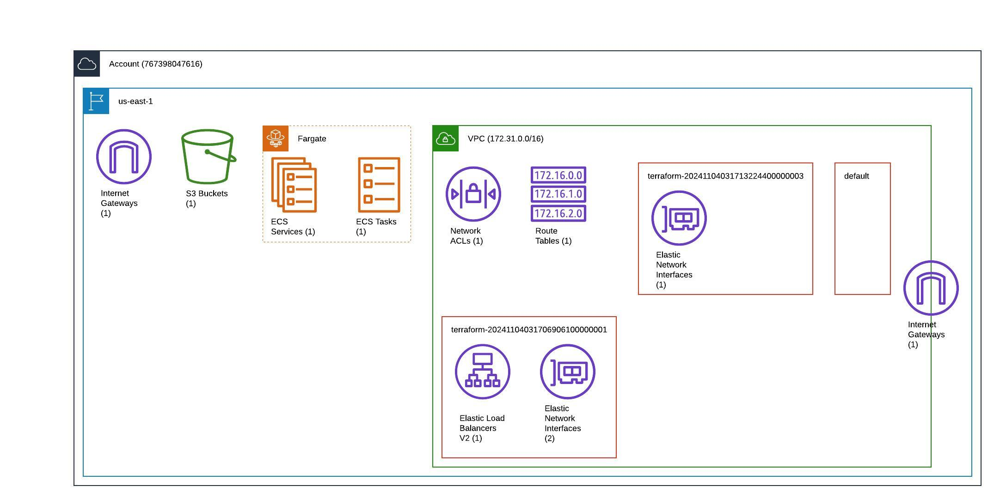
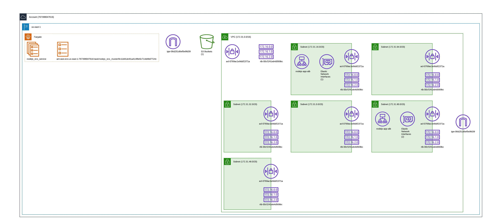
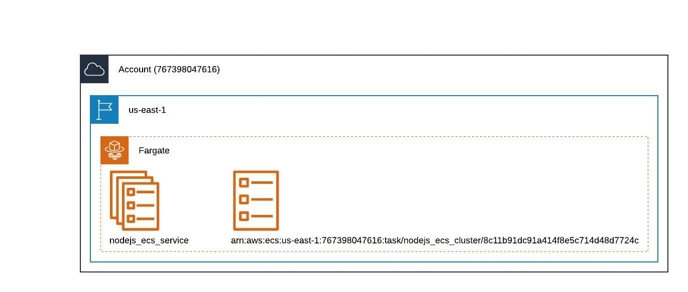
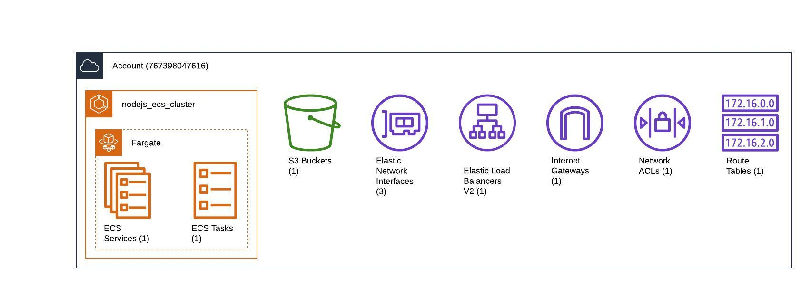

# Node.js Application Deployment Pipeline

This project demonstrates an automated deployment pipeline for a full-stack Node.js application using AWS services (ECS, CodePipeline) with Infrastructure as Code (Terraform).

## Architecture

Summarized Infrastructure : 


 Infrastructure : 


ECS : 


Resources : 



## Prerequisites

- AWS CLI configured with appropriate credentials
- Terraform installed (version 1.0.0 or later)
- Git installed
- Node.js and npm installed (for local development)

## Project Structure

```
.
├── Dockerfile                  # Container definition for the application
├── database                    # Database files
├── index.js                    # Main application entry point
├── public                      # Static assets
├── terraform
│   ├── base_infra             # Base infrastructure (CodeCommit, ECR, etc.)
│   │   ├── codebuild.tf
│   │   ├── codecommit.tf
│   │   ├── ecr.tf
│   │   └── ...
│   └── app_infra              # Application infrastructure (ECS, ALB, etc.)
│       ├── alb.tf
│       ├── ecs_cluster.tf
│       └── ...
└── views                      # EJS template files
```

## Deployment Instructions

### 1. Base Infrastructure Setup

1. Navigate to the base infrastructure directory:
   ```bash
   cd terraform/base_infra
   ```

2. Initialize and apply Terraform:
   ```bash
   terraform init
   terraform apply
   ```

3. Note the CodeCommit repository URL from the output.

### 2. Code Deployment

1. Update your Git remote to point to the new CodeCommit repository:
   ```bash
   git remote set-url origin [CodeCommit-URL-from-output]
   ```

2. Push your code to CodeCommit:
   ```bash
   git push
   ```
   You will be prompted for Git credentials for CodeCommit.

### 3. Build Process

1. Navigate to AWS CodeBuild in the AWS Console
2. Locate your build project
3. Click "Start build" to initiate the build process
4. The build will create a Docker image and push it to ECR

### 4. Application Infrastructure Deployment

1. Navigate to the application infrastructure directory:
   ```bash
   cd terraform/app_infra
   ```

2. Initialize and apply Terraform:
   ```bash
   terraform init
   terraform apply
   ```

## Infrastructure Components

### Base Infrastructure
- AWS CodeCommit repository
- Amazon Elastic Container Registry (ECR)
- AWS CodeBuild project
- IAM roles and policies
- Networking components

### Application Infrastructure
- Amazon ECS cluster
- ECS service and task definitions
- Application Load Balancer (ALB)
- Auto Scaling configuration
- CodePipeline for continuous deployment


## CI/CD Pipeline Flow

1. Code is pushed to CodeCommit repository
2. CodeBuild builds Docker image from source
3. Docker image is pushed to ECR
4. CodePipeline deploys the new image to ECS
5. Application is accessible via ALB endpoint

